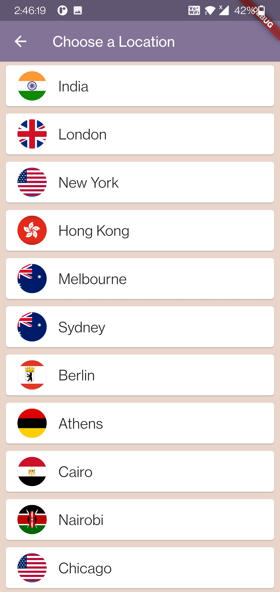

# world time

A new Flutter project.

## Getting Started

- Some ScreenShot this app . 
- This app using Free world Time API .

 &nbsp;&nbsp;&nbsp;&nbsp;&nbsp;&nbsp;&nbsp;&nbsp;&nbsp;&nbsp;

This project is a starting point for a Flutter application.

A few resources to get you started if this is your first Flutter project.

World Time API : http://worldtimeapi.org .

For help getting started with Flutter development, view the
[online documentation](https://docs.flutter.dev/), which offers tutorials,
samples, guidance on mobile development, and a full API reference.

<h3>Tools Using</h3>
- Android Studio. 
